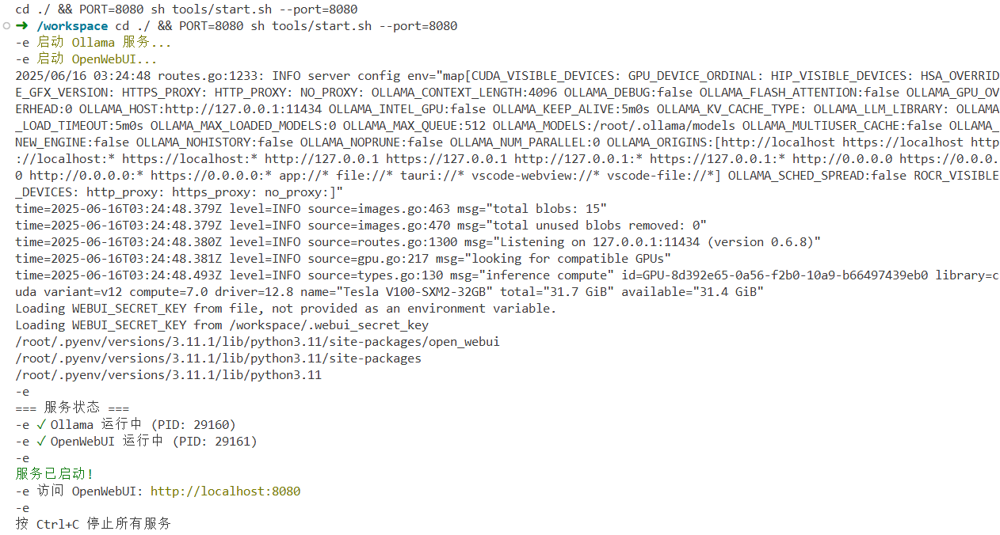
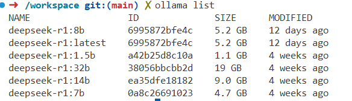
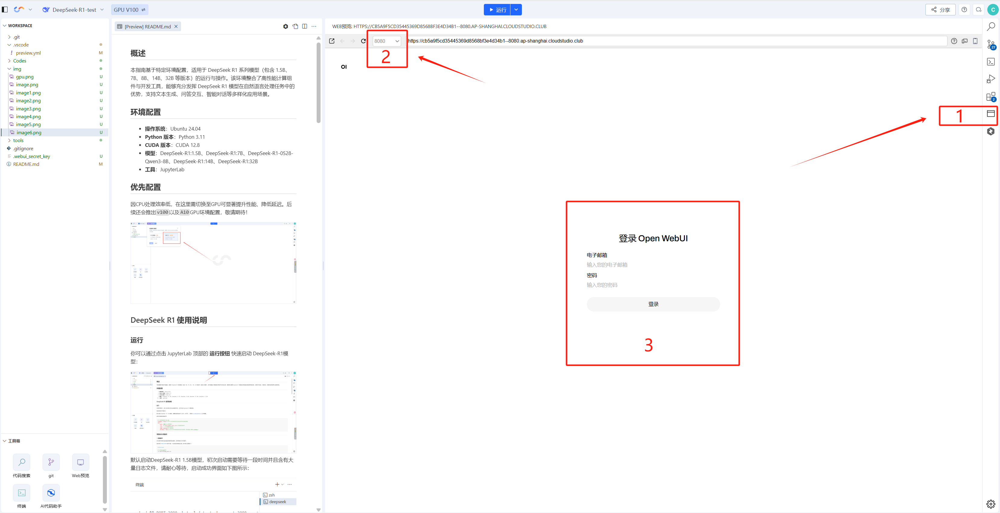
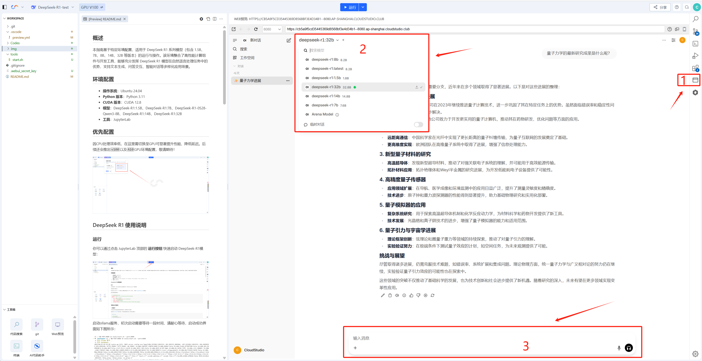

## 概述
本模板基于特定环境配置，适用于 DeepSeek R1 系列模型（包含 1.5B、7B、8B、14B、32B 等版本）的运行与操作。环境整合了高性能计算组件（如 CUDA 13.0）与开发工具（JupyterLab、OpenWebUI 等），能充分发挥 DeepSeek R1 模型在自然语言处理任务中的优势，支持文本生成、问答交互、智能对话等多样化应用场景，适合模型测试、原型开发及教学演示。

## 环境配置
- **操作系统**：Ubuntu 24.04
- **Python 版本**：Python 3.11
- **CUDA 版本**：CUDA 12.2
- **支持模型**：DeepSeek-R1:1.5B、DeepSeek-R1:7B、DeepSeek-R1-0528-Qwen3-8B、DeepSeek-R1:14B、DeepSeek-R1:32B
- **工具**：JupyterLab、CloudStudio、OpenWebUI
- **模型管理工具**：Ollama

## 优先配置
不同版本的 DeepSeek R1 模型对显存需求不同，需根据模型规格选择适配的硬件配置；同时，切换至 GPU 运行可显著提升模型推理性能、降低延迟。

### 1. 模型显存需求参考
| NAME                | ID           | SIZE    | 显存需求         |
|---------------------|--------------|---------|------------------|
| deepseek-r1:8b      | 6995872bfe4c | 5.2 GB  | 约8GB            |
| deepseek-r1:latest  | 6995872bfe4c | 5.2 GB  | 约8GB            |
| deepseek-r1:1.5b    | a42b25d8c10a | 1.1 GB  | 无需GPU          |
| deepseek-r1:32b     | 38056bbcbb2d | 19 GB   | 约32GB           |
| deepseek-r1:14b     | ea35dfe18182 | 9.0 GB  | 约12GB           |
| deepseek-r1:7b      | 0a8c26691023 | 4.7 GB  | 约4GB            |

### 2. GPU 切换指引
请根据以下图示切换至 GPU 环境，以保障大模型高效运行：


## DeepSeek R1 使用说明
### 运行
#### 启动模型服务
1. 点击 JupyterLab 顶部的 **运行按钮**，快速启动 DeepSeek-R1 模型关联的 Ollama 服务（初次启动需加载模型文件，耗时较长，请耐心等待）。
   
   

2. 服务启动成功界面如下：

   

3. 验证模型文件：在终端输入 `ollama list` 命令，可查看当前环境中已预置的 DeepSeek R1 模型，示例界面如下：

   

#### 启动并使用 OpenWebUI
1. 打开右侧的 **预览插件**，选择 `8080` 窗口（对应 OpenWebUI 服务端口）；
2. 输入登录信息：
   - 用户名：
   - 邮箱：
   - 密码：  
   （登录后可在 OpenWebUI 设置中修改个人邮箱及密码）

   

3. 进入 OpenWebUI 界面后，按以下步骤操作：
   1. 确认 OpenWebUI 界面正常加载；
   2. 在模型选择栏中，挑选所需的 DeepSeek R1 模型版本；
   3. 等待模型加载完毕后，即可在输入框中提问，进行交互。

   

### 配置文件
项目通过以下配置文件定义服务启动参数、运行逻辑，适用于 Cloud Studio 或本地自动化环境配置。

#### 1. preview.yml
[preview.yml](.vscode/preview.yml) 文件定义应用端口、启动命令及工作目录，内容如下：
```yml
# .vscode/preview.yml
autoOpen: true # 打开工作空间时是否自动开启所有应用的预览
apps:
  - port: 8080 # 应用的端口（对应 OpenWebUI 服务）
    run: sh start.sh # 应用的启动命令（执行启动脚本）
    root: ./ # 应用的启动目录
    name: deepseek # 应用名称
    autoOpen: false # 打开工作空间时是否自动开启预览（优先级高于根级 autoOpen）
```

#### 2. start.sh
[start.sh](tools/start.sh) 文件用于启动 Ollama 服务与 OpenWebUI，管理 DeepSeek R1 模型的运行，内容如下：
```bash
#!/bin/sh

# 颜色定义
GREEN='\033[0;32m'
RED='\033[0;31m'
YELLOW='\033[0;33m'
NC='\033[0m'

# 启动Ollama服务
echo -e "${YELLOW}启动 Ollama 服务...${NC}"
ollama serve &
OLLAMA_PID=$!

# 启动OpenWebUI
echo -e "${YELLOW}启动 OpenWebUI...${NC}"
open-webui serve --port 8080 &
WEBUI_PID=$!

# 等待服务启动
sleep 3

# 显示状态
echo -e "\n=== 服务状态 ==="
if ps -p $OLLAMA_PID > /dev/null 2>&1; then
    echo -e "${GREEN}✓${NC} Ollama 运行中 (PID: $OLLAMA_PID)"
    ollama_ok=1
else
    echo -e "${RED}✗${NC} Ollama 未运行"
    ollama_ok=0
fi

if ps -p $WEBUI_PID > /dev/null 2>&1; then
    echo -e "${GREEN}✓${NC} OpenWebUI 运行中 (PID: $WEBUI_PID)"
    webui_ok=1
else
    echo -e "${RED}✗${NC} OpenWebUI 未运行"
    webui_ok=0
fi

# 显示访问信息
if [ "$ollama_ok" = "1" ] && [ "$webui_ok" = "1" ]; then
    echo -e "\n${GREEN}服务已启动!${NC}"
    echo -e "访问 OpenWebUI: ${YELLOW}http://localhost:8080${NC}"
else
    echo -e "\n${RED}警告: 部分服务未能启动${NC}"
fi

echo -e "\n按 Ctrl+C 停止所有服务"

# 等待所有后台进程
wait
```

### 示例项目介绍
以下为当前模板所用示例：
- **名称**：DeepSeek R1 系列模型运行与交互模板
- **功能**：支持 DeepSeek R1 全系列模型（1.5B-32B）的加载与运行，通过 Ollama 管理模型、OpenWebUI 提供可视化交互界面，可实现文本生成、问答对话等自然语言处理任务
- **关键技术**：Ollama 模型管理、CUDA GPU 加速推理、OpenWebUI 可视化交互、Cloud Studio 环境适配

如需更换模型版本，可在 OpenWebUI 的模型选择栏中切换；如需新增模型，可通过 `ollama pull <模型名称>` 命令从 Ollama 模型库下载（例如 `ollama pull deepseek-r1:7b`）。


## 相关文档
- [DeepSeek R1 官方技术文档](https://api-docs.deepseek.com/zh-cn/news/news250120)：系统阐述 DeepSeek R1 模型的技术架构、各版本性能特性、基准测试数据，以及文本生成、问答交互等任务的使用规范与最佳实践案例。
- [DeepSeek R1 GitHub 官方仓库](https://github.com/deepseek-ai/DeepSeek-R1)：包含模型源代码、开发工具、环境搭建与部署指南，支持查看 Issues 解决问题、提交 Pull Requests 参与项目优化。
- [Ollama 官方文档](https://ollama.com/docs)：了解 Ollama 模型管理工具的命令使用、服务配置等基础操作。
- [OpenWebUI 官方文档](https://docs.openwebui.com/)：学习 OpenWebUI 的界面操作、模型配置、交互功能自定义等内容。

## 帮助和支持
### 1. Cloud Studio 相关支持
- [Cloud Studio 帮助文档](https://cloudstudio.net/docs/)
- [本模板已内置 腾讯云智能编码工具CodeBuddy Code, 点击查看使用文档](https://cloudstudio.net/docs/guide/code_editing/productivity_plugin/codebuddycode/)
### 2. 用户反馈群
扫码加入 Cloud Studio 用户反馈群，获取实时技术支持：
- 腾讯云工程师群内答疑，解决环境与训练问题；
- 优先体验产品上新功能，获取专属活动通知；
- 与其他开发者交流 LoRA 训练经验与技巧。

